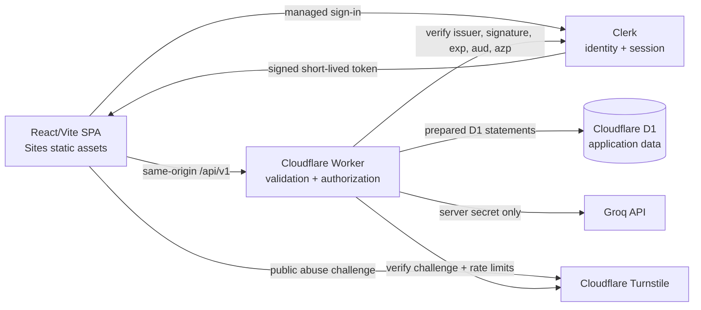

# Hanapipi Flower — Phase 14 architecture decision record

Status: **locked for implementation planning, not implemented**  
Date: 2026-08-24  
Applies to: Phases 15–26  
Canonical project register reviewed: `HANAPIPI_PROJECT_STATE.md`

## 1. Non-negotiable product invariants

- The visible brand remains **Hanapipi Flower**; customer UI remains natural Vietnamese (`vi-VN`) and VND.
- The current catalogue contains **24 entries: 23 purchasable products and one priceless, non-purchasable Easter egg**.
- `no-watering-flower` stays visible and searchable, may be wishlisted, and keeps its existing personal image, media, copy and route. It must never enter Cart, Checkout, order creation, budget filtering, Flower Finder purchase recommendations, or AI purchase candidates.
- The existing Homepage hero image, typography system, editorial videos, gifting behavior, routes and responsive navigation remain unchanged unless a later authorized phase explicitly changes them.
- Payment remains a mock choice only. Hanapipi Flower must never request, transmit, log or store card number, expiry date, CVV, bank credentials or payment-provider tokens under this roadmap.
- Groq is called only by the Cloudflare Worker. A browser bundle must never contain `GROQ_API_KEY` or any other server secret. Local deterministic fallback remains available.
- Public authentication must use a managed identity provider. Hanapipi Flower will not build password hashing, password reset, credential storage or an identity database.
- D1 is the planned source of truth for structured application data. R2 is not required because current media remains bundled/static.

## 2. Current-state inventory

| Area | Current implementation | Current authority | Production gap |
|---|---|---|---|
| Frontend | React 19 + Vite 8 + React Router 7 | Browser bundle | No server-owned commerce state |
| Hosting | OpenAI Sites plugin and existing opaque Sites project configuration | Static assets | No change in Phase 14 |
| Edge runtime | Cloudflare Worker serves assets, provides SPA fallback and handles `POST /api/concierge` | Worker | No versioned commerce API or D1 binding |
| Catalogue | `src/data/products.js`, `src/data/prices.js`, bouquet and gift add-on data | Client source code | Client may inspect and manipulate price inputs |
| Cart/delivery | `hanapipi-flower:cart` | localStorage | Device-only, client-authoritative prices and delivery time |
| Wishlist | `hanapipi-flower:wishlist` | localStorage | Device-only, no user ownership |
| Account | `hanapipi-flower:account` | localStorage | Demo password stored in clear text; not real authentication |
| Orders | `hanapipi-flower:orders` | localStorage | No trustworthy owner, idempotency or server snapshot |
| AI | Worker → Groq with strict request/response validation; client fallback | Worker for live reply, browser for fallback | No durable quota or Turnstile protection |

Current routes include the storefront, product detail, search, wishlist, cart, bouquet builder, Flower Finder, checkout/success, login/register/account, utility pages and the personal Easter-egg route. The architecture preserves these URLs; backend work changes data ownership, not the customer journey.

## 3. Target architecture

### Trust boundaries

1. **Browser is untrusted.** Product IDs, variant IDs, add-on IDs, quantities, prices, delivery dates, role claims, totals and localStorage contents are requests—not facts.
2. **Managed auth proves identity only.** The Worker validates the provider token. Application authorization and order ownership are resolved from D1 on every protected request.
3. **Worker is the policy enforcement point.** It validates schemas and sizes, canonicalizes IDs, computes totals and delivery eligibility using server time, enforces ownership, applies rate limits and emits sanitized errors.
4. **D1 is authoritative application state.** It stores canonical catalogue, variants, add-ons, user-owned cart/wishlist/profile/delivery draft, orders, idempotency records and audit metadata.
5. **External services are untrusted dependencies.** Groq output remains schema-constrained and cannot perform actions. Auth tokens are verified locally/JWKS according to provider guidance. Turnstile is verified server-side.

### Request path

- Public read traffic may access catalogue and static content without authentication.
- Authenticated requests send a short-lived provider token in `Authorization: Bearer …`; the application must not persist this token itself in Hanapipi localStorage.
- State-changing routes also require an allowed same-origin `Origin`, JSON content type, bounded body, schema validation and an idempotency key where specified.
- The Worker returns opaque request IDs. Logs contain codes, timings and entity IDs only—never auth headers, cookies, request bodies, delivery details, gift messages or AI chat text.
- No wildcard CORS is permitted. The production and explicitly approved preview origins form an allowlist.

## 4. Source-of-truth matrix

| Domain | Source of truth after cutover | Browser responsibility |
|---|---|---|
| Identity/session | Clerk | Render state and obtain short-lived token through provider SDK |
| Application role | D1 `users.role` | Never decide admin access |
| Catalogue, price, purchasability | D1 products/variants/add-ons | Display server response; cached data is advisory |
| Cart | D1 for authenticated users; localStorage only for anonymous pre-login users | Optimistic UI, then reconcile server response |
| Wishlist | D1 for authenticated users; localStorage only for anonymous pre-login users | Optimistic UI, then reconcile server response |
| Delivery preference | D1 for authenticated users; local cart draft only while anonymous | Collect a preference, not promise availability |
| Checkout totals and eligibility | Worker + D1 + Worker clock | Submit selected IDs/quantities and display canonical result |
| Orders | Immutable D1 snapshots created by Worker | Read only owned records |
| AI policy/candidates | Worker-validated knowledge and purchasable catalogue | Send bounded question/history; local fallback only |
| UI-only preferences | Browser localStorage | Remain device-local and contain no secrets/PII |

## 5. Authentication provider decision

Research was limited to three managed providers and official current documentation. Pricing and quotas are not contractual; re-check them immediately before Phase 17.

| Criterion | Clerk | Auth0 | Supabase Auth |
|---|---|---|---|
| React/Vite fit | First-party React SDK; prebuilt UI or custom email/password and OAuth flows | Mature React SPA SDK using Authorization Code + PKCE and Universal Login | React quickstart and JS SDK; custom UI is straightforward |
| Cloudflare Worker verification | Backend SDK/manual JWT verification supports public key/JWKS, `audience` and `authorizedParties`; suitable for Worker Web APIs | API access tokens can be verified against tenant JWKS, audience and scopes; runtime glue must be tested | Asymmetric JWTs can be verified from project JWKS; client manages access/refresh sessions |
| Email + Google | Both supported; production Google uses project-owned OAuth credentials | Database connection plus social connections, including Google | Password, OTP/magic link and Google supported |
| Brand customization | Custom React flows allow Hanapipi to retain the existing page styling | Universal Login is secure and brandable, but hosted-widget/page-template limits can constrain pixel-perfect layout | Full custom UI in the SPA |
| Free-tier feasibility as checked 2026-08-24 | Current pricing advertises 50,000 monthly retained users | Current B2C Free tier advertises up to 25,000 external active users | Free tier advertises 50,000 MAU; project pauses after one inactive week |
| Session/security model | Managed sessions; short-lived signed tokens; Worker can bind token to expected parties | Managed sessions; React SDK handles rotation/caching; Worker validates API JWT | Access JWT + rotating refresh token; some advanced session limits are paid |
| Privacy/lock-in | Provider stores identity/profile data; application data stays in D1. Export/deletion procedures must be rehearsed | Provider stores identity profiles; export is supported, password hashes are intentionally constrained | Auth users live in the provider’s Postgres project, creating a second persistent data plane beside D1 |
| Operational fit | Lowest-friction custom branded UI and clean Worker verification | Strong backup with mature B2C controls, but more redirect/tenant configuration | Technically viable but duplicates the D1 data plane and Free pause behavior adds availability risk |

### Decision

- **Recommended: Clerk.** Use `@clerk/react` custom flows only if they can preserve current accessibility and styling; otherwise use the provider’s maintained components with Hanapipi branding. The Worker verifies signed session tokens with the provider public key/JWKS and checks signature, issuer, expiry/not-before, audience and `authorizedParties`. D1 maps the provider `sub` to a local user and owns all authorization roles.
- **Backup: Auth0 Universal Login.** Use the React SPA SDK, Authorization Code + PKCE and a registered Hanapipi API audience. Prefer maintained Universal Login over embedded password forms. Its hosted UX and tenant customization must be accepted before switching.
- **Not selected: Supabase Auth.** It meets the authentication requirements, but using it only for identity while D1 owns application state creates an avoidable second database/data-lifecycle surface. It remains an evaluated option, not a Phase 17 fallback.

Official decision sources:

- Clerk custom email/password and OAuth flows: [custom email/password](https://clerk.com/docs/guides/development/custom-flows/authentication/email-password), [custom OAuth](https://clerk.com/docs/guides/development/custom-flows/authentication/oauth-connections), [Google production setup](https://clerk.com/docs/guides/configure/auth-strategies/social-connections/google).
- Clerk server verification and current pricing: [`verifyToken`](https://clerk.com/docs/reference/backend/verify-token), [manual JWKS verification](https://clerk.com/docs/guides/sessions/manual-jwt-verification), [pricing](https://clerk.com/pricing).
- Auth0 React, JWT and branding: [React SDK](https://auth0.com/docs/libraries/auth0-react), [access-token validation](https://auth0.com/docs/secure/tokens/access-tokens/validate-access-tokens), [Universal Login](https://auth0.com/docs/customize/login-pages/universal-login), [pricing](https://auth0.com/pricing).
- Supabase assessment: [React Auth](https://supabase.com/docs/guides/auth/quickstarts/react), [JWT/JWKS](https://supabase.com/docs/guides/auth/jwts), [sessions](https://supabase.com/docs/guides/auth/sessions), [pricing](https://supabase.com/pricing).

## 6. Security architecture controls

### Worker and HTTP

- Route every application API through `/api/v1`; retain `/api/concierge` only as a temporary compatibility alias to the same implementation.
- Validate method, exact/allowlisted keys, types, enum values, lengths, item counts and total body bytes before business logic.
- Use parameterized D1 statements only. Dynamic sort/filter values map through server allowlists; never concatenate user input into SQL.
- Apply security headers to HTML and API responses: a tested Content Security Policy, `frame-ancestors 'none'`, HSTS on production, `X-Content-Type-Options: nosniff`, strict `Referrer-Policy` and a minimal `Permissions-Policy`.
- Return `Cache-Control: no-store` for authenticated, PII, order and AI responses. Public catalogue responses may use bounded revalidation with an explicit version/ETag.
- Reject unsupported origins and content types. Never reflect arbitrary origins into CORS headers.

### Authentication and authorization

- Verify tokens server-side on every protected request; never trust a client `userId`, email, role or order owner.
- Resolve `users.id` from the verified provider subject. Resource queries always scope by that D1 user ID.
- Resolve admin role from D1, require an authenticated provider subject and log privileged mutations. Client route guards are only presentation.
- Keep provider secrets and JWT verification configuration in Worker secrets/vars; publishable frontend identifiers may be public, secret keys may not.

### Abuse controls

- Use Cloudflare rate limiting at both per-IP/device and per-authenticated-user dimensions. Define separate classes for public reads, mutations, checkout, admin and AI.
- Require a server-verified Turnstile token for anonymous AI usage and for suspicious/repeated high-risk attempts; never accept a browser-only success flag.
- Cap AI message/history/candidate counts, keep strict output schemas, filter to server-known purchasable candidates and preserve local fallback.
- Apply request deadlines and upstream response-size caps. Fail closed for commerce and fail to the deterministic local response for AI.

### Data protection

- Minimize PII. Identity provider owns credential data; D1 stores only the profile/fulfilment data required by the product.
- Encrypt delivery/contact/gift-message fields at the application layer using versioned Worker-held keys before D1 storage. Never log plaintext or include it in audit events.
- Store timestamps in UTC and render Vietnamese dates at the UI edge.
- Define retention/deletion before production: abandoned drafts, order fulfilment PII, audit events, idempotency records and provider accounts require separate schedules.
- Back up and restore-test D1 before destructive migrations; schema changes must be forward-compatible during rolling deployment.

## 7. Phase ownership and rollout gates

| Phase | Owner/outcome | Entry gate | Exit evidence |
|---|---|---|---|
| 15 | Worker API foundation | Phase 14 docs approved | `/api/v1` router, validation/error contract, headers, request IDs; no commerce migration |
| 16 | D1 foundation | D1 account/database approved | Versioned migrations, seed validates 24/23/1 invariant, backup/restore rehearsal |
| 17 | Managed auth | Clerk tenant, domains and privacy decisions approved | Email + Google, token verification, D1 user mapping, no local password |
| 18 | Server catalogue/pricing | D1 seed verified | Client cannot set price; all IDs canonicalized; Easter egg invariant tests |
| 19 | Durable cart/wishlist | Auth and canonical catalogue live | Owned state, explicit merge, stale local data handling |
| 20 | Checkout/order creation | Retention and checkout-auth decision locked | Server time/total, idempotent creation, immutable snapshot, no card data |
| 21 | Account/order history | Ownership tests pass | User sees only own orders; legacy demo orders remain segregated |
| 22 | Admin order management | Admin identity/role owners approved | D1 role enforcement, least privilege, audit trail |
| 23 | Abuse + AI hardening | Turnstile/site keys and rate-limit budget approved | Quotas, prompt-injection tests, graceful fallback |
| 24 | Security hardening | Staging data flows stable | CSP, dependency review, key rotation, PII/log review, threat checks |
| 25 | Staging migration | Rollback rehearsal passed | Feature-flag canary, metrics, restore drill, user acceptance |
| 26 | Production cutover | Explicit owner approval | Monitored rollout, rollback window, post-cutover reconciliation |

## 8. Decisions required later

1. Approve Clerk as primary provider and Auth0 as backup; supply provider tenant and Google OAuth configuration only in Phase 17 through secret-safe channels.
2. Approve the production/preview domain allowlist and the owner accounts allowed to become admin.
3. Accept the secure default that **server checkout requires sign-in**. Supporting guest order history would require a separate magic-link/opaque order-access design and is not assumed.
4. Set retention windows for customer profile, delivery PII, gift messages, orders, audit events and idempotency records; obtain appropriate Vietnamese privacy/legal review.
5. Confirm operational ownership for D1 backup/restore, incident response, provider account recovery and secret rotation.
6. Re-check auth, Turnstile and Cloudflare rate-limit pricing/quotas immediately before purchase or Phase 17/23 activation.

## 9. Gate status

The architecture contract is ready for review. Phase 15 is **technically unblocked but not authorized by this Phase 14 request**. No implementation, package, source, configuration, database, hosting or production behavior has been changed.
